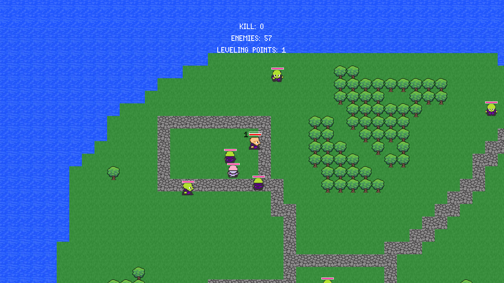
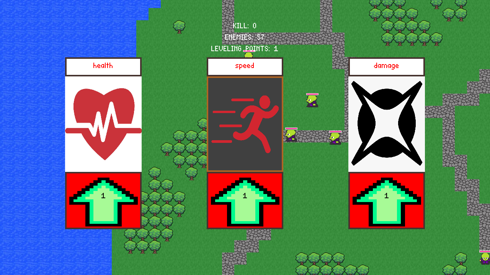
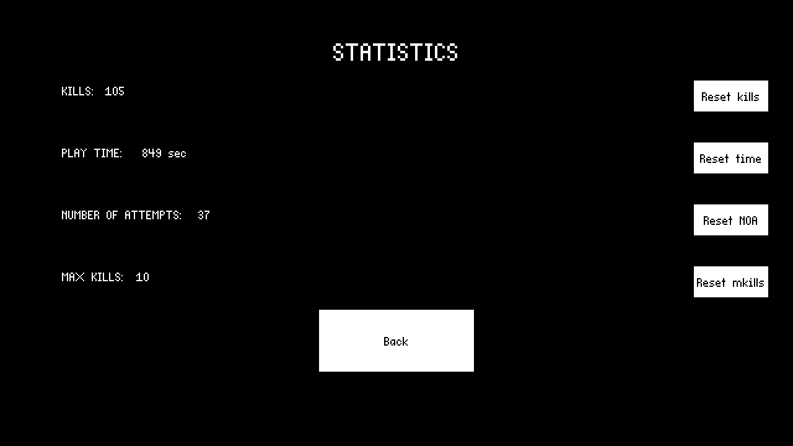

# Against everyone

### In-game screenshots:

<div style="text-align: center;">
    
    
      

</div>


### Project Description

On behalf of the king, you were sent to an island that is teeming with robbers. You need to destroy everyone! But be careful, this may be your last trip... 
You will find a system of gaining experience and leveling, a lot of enemies and new emotions!


- BIG MAP
- Saving statistics
- Pumping system
- 2 types of enemies


### Controls:

---

| Buttons | Action | | Buttons                     | Action                  |
| --- | --- | --- |-----------------------------|-------------------------|
| `W` | move UP | | `SPACE`                         | hit |
| `S` | move DOWN | | `J`                         | open level up menu
| `A` | move LEFT | 
| `D` | move RIGHT |


### How to play:

To download my project you should git clone it from this address:

```
https://github.com/KrllF/PYTHONRPG.git
```

Start main.py


Have fun or suffer!

---
### Creator
> [@KrllF](https://github.com/KrllF)
